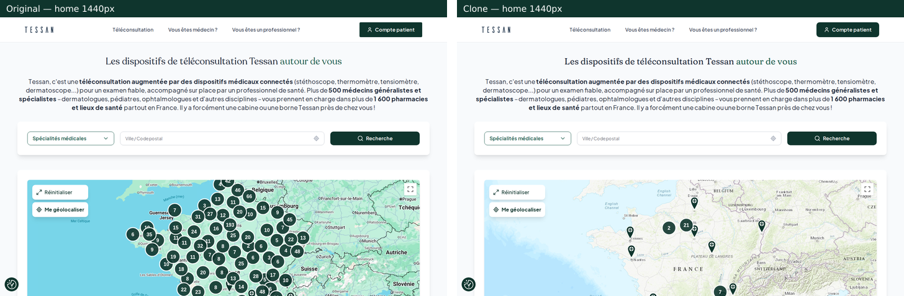
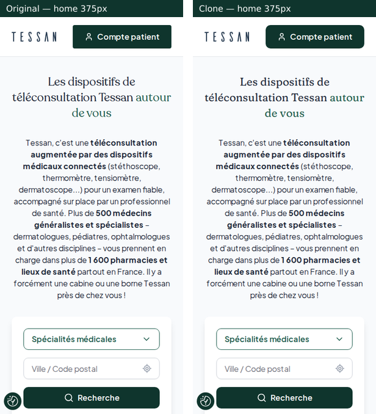
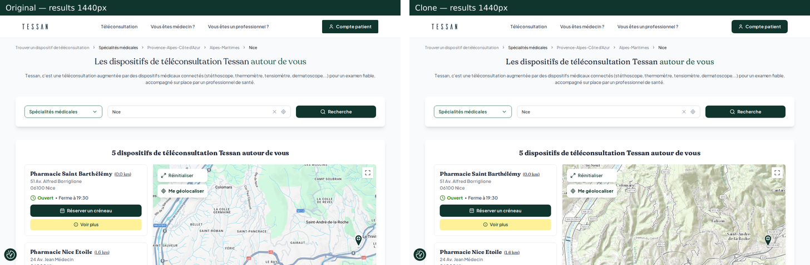
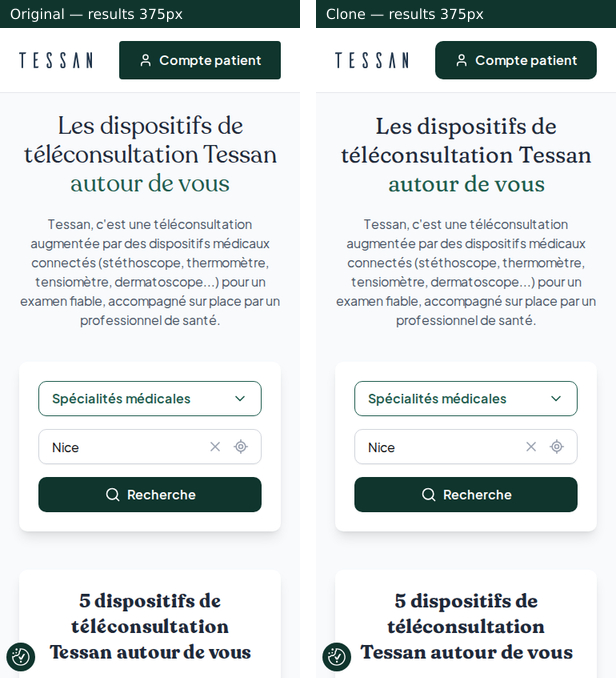
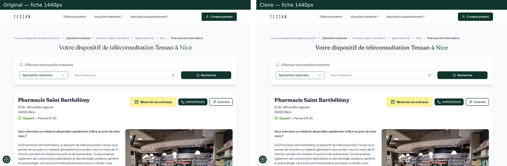
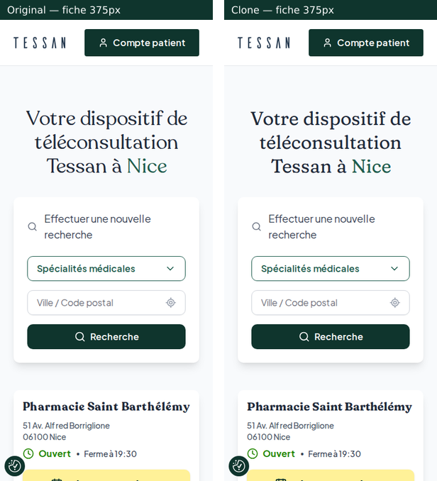
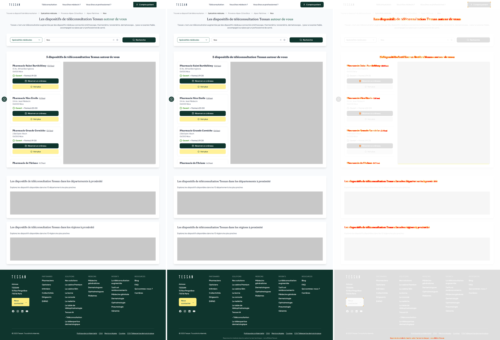

# Reproduction de teleconsultation.tessan.io

- **Site déployé : https://tessan-teleconsultation-clone.vercel.app**
- **Dépôt : https://github.com/Herrifunix/tessan-teleconsultation-clone**

Reproduction aussi fidèle que possible du localisateur de dispositifs de téléconsultation https://teleconsultation.tessan.io/, réalisée pour un test technique (alternance full-stack). Le site n'est pas indexé (`noindex`, `robots.txt`) et porte en pied de page la mention « Reproduction réalisée dans le cadre d'un test technique — non affiliée à Tessan ».

Pages à essayer :
[accueil](https://tessan-teleconsultation-clone.vercel.app/) ·
[résultats Nice](https://tessan-teleconsultation-clone.vercel.app/fr/france-FR/nice/results) ·
[fiche d'une pharmacie](https://tessan-teleconsultation-clone.vercel.app/provence-alpes-cote-d-azur/alpes-maritimes/nice/557/pharmacie-saint-barthelemy) ·
[région](https://tessan-teleconsultation-clone.vercel.app/provence-alpes-cote-d-azur) ·
[Franconville (règle du minimum)](https://tessan-teleconsultation-clone.vercel.app/fr/france-FR/franconville/results)

## Original et clone côte à côte

Captures prises dans les mêmes conditions (même Chromium, horloge fixée au vendredi 25/09/2026 15:00 à Paris, cookies refusés, polices et images chargées). Pages complètes et diff pixel : `docs/qa/<gabarit>-<largeur>-composite.png`.

| Desktop 1440 px | Mobile 375 px |
|---|---|
|  |  |
|  |  |
|  |  |

Composite complet « original | clone | diff » (résultats, 1440 px) :



**Mesures (itération 3)** : pixels différents hors zones masquées de 0,44 % à 1,07 % selon la capture (9 captures : 3 gabarits × 375/768/1440). Élément par élément, 98 à 100 % des textes sont à ±2 px de l'original, sans aucun écart de taille, graisse, interligne, couleur ni fond (`docs/qa/diff-report.json`, `docs/qa/layout-report.json`, détail dans `docs/progress.md`).

## Commandes

Node 22.22.2 (`.nvmrc`), versions exactes et `package-lock.json` commité.

```bash
npm install          # dépendances (versions figées)
npm run dev          # serveur de développement Vite (http://localhost:5173)
npm run build        # jetons → CSS, puis build de production dans dist/
npm run preview      # sert dist/ sur http://localhost:4173
npm run verify       # lint + typecheck + build + 134 tests e2e + captures du clone + diff avec l'original
npm run done-check   # vérifie docs/checklist.json (chaque exigence a une preuve vérifiable)
```

Tests contre le site public : `PLAYWRIGHT_BASE_URL=https://tessan-teleconsultation-clone.vercel.app npx playwright test`.
Playwright utilise le Chromium installé (`npx playwright install chromium` si besoin).

## Fonctionnalités reproduites

- **3 gabarits, mêmes routes que l'original** : accueil `/`, résultats (`/fr/france-FR/<ville>/results`, `/<région>`, `/<région>/<département>`, `/<région>/<département>/<ville>`, préfixe de spécialité `/dermatologue/...`), fiche `/<région>/<département>/<ville>/<code>/<slug>`. Une seule route « attrape-tout », comme l'application Next.js d'origine ; rechargement direct de toute route.
- **Recherche** : autocomplétion sur les villes de l'échantillon (insensible à la casse et aux accents, tolérante aux fautes de frappe, noms composés), géocodage via l'**API Adresse** (repli automatique sur la Géoplateforme IGN, même format), délai de 5 s puis message clair, tri par distance (haversine), 20 plus proches après une recherche, règle de l'original « 3 résultats ou moins → +5 plus proches ».
- **Géolocalisation** du navigateur, avec les messages de l'original en cas de refus ou d'indisponibilité.
- **Menu « Spécialités médicales »** (souris et clavier), URL de spécialité, relance automatique, « Effacer le filtre » ; créneaux réservables propres à chaque spécialité.
- **Carte** Leaflet chargée à la demande : clusters au même algorithme que l'original (SuperCluster, rayon 65, zoom max 11), zoom +3 au clic sur un cluster, popups de pharmacie, synchronisation liste → carte, « Réinitialiser », « Me géolocaliser », plein écran ; sur l'accueil, clic sur un marqueur → résultats dans un rayon de 10 km.
- **Cartes de pharmacie** : distance (lien d'itinéraire), statut « Ouvert · Ferme à 19:30 », « Fermé · Réouvre 14:30 », « Ouvre demain à 09:00 » calculé **en heure de Paris** quel que soit le fuseau du visiteur, « Réserver un créneau » seulement si la pharmacie le permet, « Voir plus ».
- **Réservation** en 4 étapes (spécialité → créneau → e-mail → confirmation) avec les créneaux de l'original (jours fériés 2026, « Aujourd'hui », « Demain », « Maintenant »). Rien n'est envoyé : l'écran de confirmation le dit.
- **Fiche** : description mise en forme sans injection de HTML, carrousel photo, carte principale, horaires commençant par le jour courant, FAQ en accordéon, 6 dispositifs à proximité, départements et régions à proximité.
- **Départements et régions à proximité** calculés comme l'original (distance moyenne depuis Paris sur l'accueil, depuis le point recherché ailleurs), fil d'Ariane cliquable (masqué sous 768 px, comme l'original).
- **Bannière de cookies** au style CookieYes : accepter, refuser, personnaliser par catégorie, bouton de rappel, choix mémorisé.
- **Responsive** de 320 px à 1440 px (et zoom navigateur 200 %) avec les breakpoints de l'original ; comme l'original, pas de menu burger sous 1024 px.
- **Accessibilité** : HTML sémantique, combobox/listbox ARIA, navigation complète au clavier, focus visible, `prefers-reduced-motion` respecté.

## Stack et décisions

Vite 7 · React 19 · TypeScript 5.9 · React Router 8 · Tailwind CSS 4.1.14 (même version que l'original, **thème par défaut vidé** : seules les variables issues de `docs/research/tokens.json` existent) · Leaflet 1.9 + supercluster · Playwright · déploiement Vercel.

Les choix sont comparés et motivés dans [`docs/DECISIONS.md`](docs/DECISIONS.md) :
(a) **carte** : Google Maps / MapLibre / Leaflet → Leaflet + tuiles Esri World Topographic, les plus proches du rendu Google sans clé d'API (repli OSM) ;
(b) **données** : Supabase de Tessan en direct / base complète / échantillon → **58 points de vente réels** au format de la table de l'original (`src/data/locations.json`, sélection justifiée ligne par ligne dans `src/data/sample-selection.json`) ;
(c) **déploiement** : Vercel / GitHub Pages / Netlify → Vercel (routes à la racine, réécriture SPA en 200).

Autres décisions notables : police serif (Recoleta est commerciale → Fraunces sous licence OFL, calibrée), statut d'ouverture en Europe/Paris, réservation sans envoi, aucun code de l'original publié.

## Écarts connus et raisons

| Écart | Raison |
|---|---|
| Forme des lettres des titres (serif) | Recoleta est une police commerciale (© Latinotype) : non redistribuable. Remplacée par des instances de **Fraunces** (OFL) choisies par recherche systématique et **calibrées aux tailles d'usage** (`size-adjust`, métriques verticales) : même encombrement à ±2 % et mêmes retours à la ligne, mais les glyphes diffèrent. |
| Fond de carte | Google Maps exige une clé et une facturation. Tuiles Esri sans clé, marqueurs, clusters et popups identiques. La carte est masquée dans le diff pixel. |
| Nombres de dispositifs, départements et régions à proximité | Échantillon de 58 points (l'original en a environ 1 800) : les listes sont exactes pour les villes échantillonnées (Nice : mêmes 5 résultats, mêmes distances, même ordre), mais les compteurs par zone diffèrent. Grilles masquées dans le diff. |
| Suggestions d'adresse | L'original utilise Google Places (clé requise) ; le clone combine les villes de l'échantillon et l'API Adresse, avec le même comportement. |
| Statut ouvert / fermé | L'original le calcule avec l'heure **locale du navigateur** ; le clone utilise l'heure de Paris, comme l'exige le sujet (identique pour un visiteur en France). |
| Réservation | Aucun envoi (pas de back-end) : la dernière étape indique qu'aucune réservation n'a été transmise. |
| Pied de page | Mention de non-affiliation ajoutée (+16 à 40 px de hauteur). |
| Détails de DOM sans effet visuel | Horaires en `<table>`, cartes en `<article>`, lien de distance avec une vraie URL (l'original utilise `href="#"`), description rendue par un parseur sûr au lieu de `dangerouslySetInnerHTML`. |
| Processus | Les composants ont été livrés dans un seul commit au lieu d'un commit par composant (exigence P3-01 laissée en échec dans la checklist : la corriger demanderait un force-push). |

<!-- EVALUATEURS -->

## Méthode

1. **Reconnaissance** (Playwright, fr-FR, Europe/Paris, UA réel, rythme humain) : le site est protégé par le « Vercel Security Checkpoint », dont le cookie est lié à l'IP ; l'IP de sortie de l'environnement changeant à chaque connexion, toutes les requêtes passent par **un seul tunnel keep-alive** (`tools/recon/sticky.mjs`). Cartographie des gabarits, captures de référence à 375, 768 et 1440 px plus 33 états (survols, menus, popups, modale, cookies) dans `docs/reference/`.
2. **Mesure plutôt qu'estimation** : feuilles de style de l'original, `getComputedStyle` des éléments clés, états de survol → `docs/research/tokens.json` (137 jetons, chacun avec sa provenance). Lecture des modules applicatifs pour reproduire les règles métier (tri, règle du minimum, textes de statut, créneaux). 17 specs de composants et un modèle d'interaction (`docs/research/components/`, `docs/research/interactions.md`).
3. **Tests d'abord** : 9 suites e2e (61 tests déclarés, certains répétés par fuseau horaire ou par largeur) écrites d'après le comportement de l'original **avant** les composants (commit `1969355`, localisateurs par rôle et texte), complétées ensuite par une matrice gabarit × largeur × interaction ; 134 tests exécutés au total (dont 14 de non-régression issus de l’évaluation indépendante), verts en local et contre l'URL publique. Toute modification de test est justifiée dans `docs/progress.md`.
4. **Boucle de diff** (`tools/capture.mjs`, `tools/diff.mjs`, `tools/compare-layout.mjs`) : captures dans des conditions identiques, pixelmatch avec masques des zones dépendant des données, réalignement entre zones masquées, composites « original | clone | diff », points chauds inspectés région par région, comparaison élément par élément (position ±2 px, styles calculés). 3 itérations. Un écart persistant (noms en gras trop étroits) a été résolu en testant 3 hypothèses par la mesure : le hinting de Recoleta rend ses largeurs non proportionnelles à la taille.
5. **Évaluation indépendante** : deux sous-agents en lecture seule (fidélité visuelle ; fonctionnel et responsive), notes 1/3/5, puis corrections et seconde évaluation.
6. **Suivi** : `docs/checklist.json` (chaque exigence du sujet avec une preuve vérifiable, contrôlé par `npm run done-check`), `docs/PLAN.md`, `docs/progress.md`, `docs/DECISIONS.md`.

## Pistes

- Remplacer l'échantillon par une API (proxy vers une base autorisée) pour des compteurs exacts, avec cache et pagination.
- Suggestions d'adresse plus riches (adresses complètes et lieux, pas seulement les villes) avec l'API Adresse en `type=housenumber`.
- Vraie prise de rendez-vous (back-end, confirmation par e-mail), si l'API de Tessan l'autorisait.
- Rendu serveur ou pré-rendu des pages de ville pour le référencement (l'original est rendu par Next.js), une fois l'indexation souhaitée.
- Police serif sous licence (Recoleta) si le projet la possède, pour supprimer le dernier écart visuel.
- Tests de régression visuelle en CI (GitHub Actions) avec les captures de référence comme base.

## Arborescence

```
src/            application (pages, composants, lib, données, styles générés depuis les jetons)
public/         logo, marqueur, favicon, icônes, polices
tests/          tests e2e Playwright (134)
tools/          reconnaissance, captures, diff, génération des jetons, calibration des polices, données
docs/           checklist, plan, journal, décisions, recherche (jetons, specs), captures de référence et QA
```
